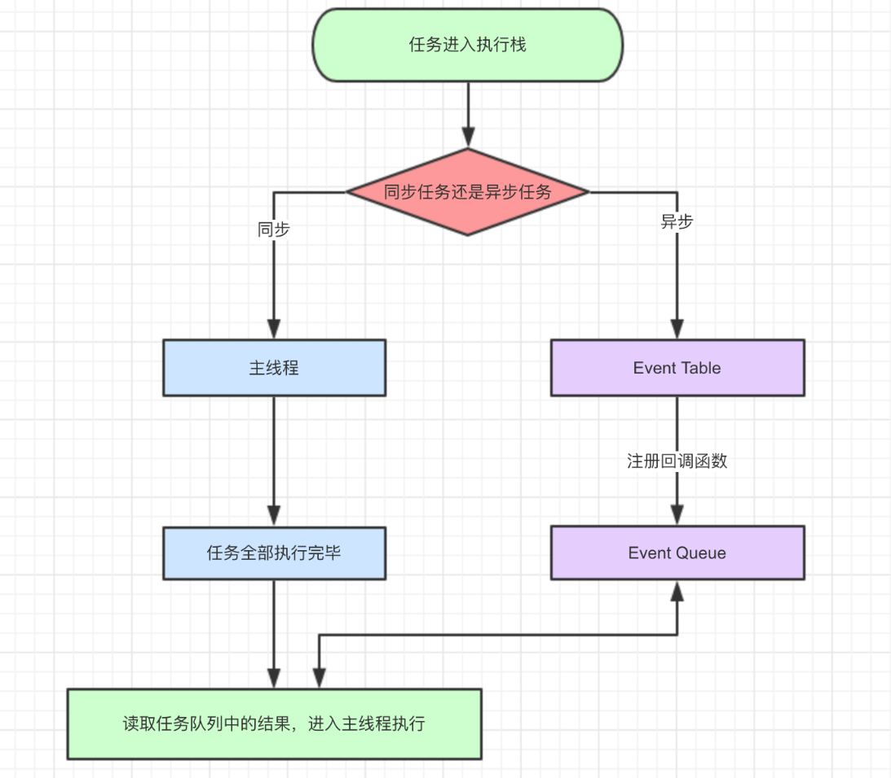
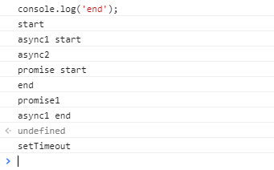

### JavaScript 执行机制

#### 一、关于 JavaScript

-   众所周知，JavaScript 在诞生之日就是一门单线程的非阻塞脚本语言。这是由最初的用途来决定的：与浏览器交互。
-   单线程意味着，JavaScript 在执行代码的时候，都只有一个主线程来执行任务。
-   而非阻塞则是当代码需要进行一项异步任务的时候，主线程会挂起，然后在异步任务返回结果后再根据一定的规则去执行相应的回调函数。
-   单线程是必要的，也是 JavaScript 这门语言的基石，因为在浏览器中我们需要各种各样的 dom 操作。试想一下如果 JavaScript 是多线程的，那么当两个线程同时去操作同一个 dom，例如一个向其添加事件，另外一个删除该 dom 节点，此时该如何处理，为了保证不会发生类似的事情，JavaScript 选择只用一个线程来执行代码，这样就保证了程序执行的一致性。

#### 二、 javascript 事件循环

JavaScript 事件循环机制分为浏览器和 Node 事件循环机制，两者的实现技术不一样，浏览器 Event Loop 是 HTML 中定义的规范，Node Event Loop 是由 libuv 库实现。这里主要讲的是浏览器部分。

既然 JavaScript 是单线程，那么就像只有一个窗口的银行一样，客户需要一个个排队办理业务，同理 js 任务也要一个一个顺序执行。如果一个任务耗时过长，那么后一个任务必须排队等着。那么问题来了，如果我们想要浏览一个网页，加载一张很大的图片，难道我们要一直让网页卡着，等待图片加载完才显示吗？因此 JavaScript 将任务分为两类：

-   同步任务
-   异步任务

当我们打开网页的时候，网页的渲染过程就是一大堆同步任务，比如页面骨架和页面元素的渲染。而像加载音乐、图片、数据请求等就是异步任务。



上图的内容可以用文字来描述:

-   同步任务和异步任务分别进入不同的场所，同步的进入主线程，异步的进入 Event Table 并注册函数。
-   当指定的事情完成时，Event Table 会将这个函数移入 Event Queue。
-   主线程内的任务执行完毕为空，就会去 Event Queue 读取对应的函数，进入主线程执行。
-   上述过程会不断重复，也就是常说的 Event Loop(事件循环)。

我们不禁要问了，那怎么知道主线程执行栈为空啊？js 引擎存在 monitoring process 进程，会持续不断的检查主线程执行栈是否为空，一旦为空，就会去 Event Queue 那里检查是否有等待被调用的函数。

#### 三、 setTimeout

setTimeout 在我们的印象中就是异步执行函数，我们经常可以这样使用：

```js
setTimeout(() => {
    console.log("延时3s执行");
}, 3000);
```

逐渐 setTimeout 用的多了，问题也出现了，我们有时候写的是 3s 后执行，为何有时候要等 4s,5s 后才会执行：

```js
setTimeout(() => {
    task();
}, 3000);

console.log("console执行");
```

根据前面的结论，setTimeout 是异步的，应该先执行 console.log()这个同步任务，所以我们的结论是先执行 console.log(),然后执行 task();

然后我们修改上面的代码：

```js
setTimeout(() => {
    task();
}, 3000);

sleep(10000000);
```

乍一看其实差不多嘛，但我们把这段代码在 chrome 执行一下，却发现控制台执行 task()需要的时间远远超过 3 秒，说好的延时三秒，为啥现在需要这么长时间啊？

这时候我们需要重新理解 setTimeout 的定义。我们先说上述代码是怎么执行的：

-   setTimeout()进入到 Event Table 进行注册，计时开始；
-   执行 sleep()函数；
-   3s 到了，计时完成，task()进入到 Event Queue(`事件队列`),但是 sleep 执行的比较慢，还在执行，task()处于等待执行状态；
-   sleep()执行完成后，task()终于从 Event Queue 进入了主线程执行;

上述流程走完，我们知道 setTimeout 这个函数是经过指定时间后，把要执行的任务加入到 Event Queue 中然后在进入到主线程中执行，又因为 js 是单线程，任务要一个一个的执行，如果前面的任务还在执行，那么只能等着，导致时间会大于 3s。

我们还经常遇到 setTimeout(fn,0)这样的代码，0 秒后执行又是什么意思呢？是不是可以立即执行呢？

答案是不会的，setTimeout(fn,0)的含义是，指定某个任务在主线程最早可得的空闲时间执行，意思就是不用再等多少秒了，只要主线程执行栈内的同步任务全部执行完成，栈为空就马上执行。

关于 setTimeout 要补充的是，即便主线程为空，0 毫秒实际上也是达不到的。根据 HTML 的标准，最低是`4毫秒`。

#### 四、 JS 的宏任务和微任务

除了广义的同步任务和异步任务，我们对任务有更精细的定义：

-   macro-task(宏任务)：包括整体代码 script > setImmediate > MessageChannel > setTimeout > setInterval
-   micro-task(微任务)：process.nextTick > Promise > MutationObserver

不同的任务会进入到不同的 Event Queue,比如 setTimeout 和 setInterval 会进入到相同的 Event Queue。

事件循环的顺序决定，决定 js 代码的执行顺序。进入整体代码（宏任务）后，开始第一次循环，接着执行所有的微任务，然后再次从宏任务开始，找到其中一个任务队列执行完毕，在执行所有的微任务。

```js
setTimeout(function() {
    console.log("setTimeout");
});

new Promise(function(resolve) {
    console.log("promise");
}).then(function() {
    console.log("then");
});

console.log("console");
```

-   这段代码作为宏任务开始执行;
-   遇到`setTimeout()`宏任务，将其回调加入到`宏任务Event Queue`中;
-   接下来遇到`new Promise`，立即执行，然后遇到`then`函数，将其分发到`微任务Event Queue`;
-   遇到 console.log，立即执行；
-   到此，`整体script代码`作为第一个`宏任务`已经执行完了，然后去`微任务Event Queue`里寻找微任务进行执行，这时发现了 then，并且进行执行;
-   第一轮事件循环结束，然后开始第二轮事件循环，当然要去`宏任务Event Queue`里去寻找，然后发现了 setTimeout 里的回调函数，然后进行执行;

事件循环，宏任务，微任务的关系如图所示：


下面代码看看执行结果如何?

```js
console.log("1");

setTimeout(function() {
    console.log("2");
    process.nextTick(function() {
        console.log("3");
    });
    new Promise(function(resolve) {
        console.log("4");
        resolve();
    }).then(function() {
        console.log("5");
    });
});
process.nextTick(function() {
    console.log("6");
});
new Promise(function(resolve) {
    console.log("7");
    resolve();
}).then(function() {
    console.log("8");
});

setTimeout(function() {
    console.log("9");
    process.nextTick(function() {
        console.log("10");
    });
    new Promise(function(resolve) {
        console.log("11");
        resolve();
    }).then(function() {
        console.log("12");
    });
});
```

完整输出为：1，7，6，8，2，4，3，5，9，11，10，12。

第一轮事件循环如下：

-   整体`script`代码作为第一个`宏任务`进入到`主线程`，遇到`console.log(1)`,输出 1；
-   遇到`setTimeout`，加入到`宏任务 Event Queue`，这里记为 setTimeout1;
-   遇到`process.nextTick`,加入到`微任务 Event Queue`，我们记为 process1；
-   遇到`new Promise`,立即执行`console.log(7)`,输出 7，然后将`then`加入到`微任务 Event Queue`，我们记为 then1；
-   遇到最后一个`setTimeout`，加入到`宏任务 Event Queue`，这里记为 setTimeout2;

| 宏任务      | 微任务   |
| ----------- | -------- |
| setTimeout1 | process1 |
| setTimeout2 | then1    |

-   上表示第一轮事件循环宏任务结束时，`宏任务Event Queue`和`微任务Event Queue`的情况，此时已经输出 1,7；
-   这时有两个微任务`process1`和`then1`；
-   首先执行`process1`，输出 6；
-   然后执行`then1`，输出 8；

此时，第一轮事件循环已经结束，第一轮事件循环已经输出的值为：1,7,6,8；接下来执行第二轮事件循环，第二轮事件循环从 setTimeout1 开始。

-   `setTimeout1`中首先执行`console.log('2')`,输出 2；
-   然后将`process.nextTick`加入到`微任务 Event Queue`，这里记为 process2；
-   遇到`new Promise`,立即执行`console.log(4)`,输出 4，然后将`then`加入到`微任务 Event Queue`，我们记为 then2；

此时宏任务和微任务 Event Queue 的情况如下表：

| 宏任务      | 微任务   |
| ----------- | -------- |
| setTimeout2 | process2 |
|             | then2    |

-   第二轮事件循环宏任务执行结束后，已经输出的值为：2,4；
-   然后执行`process2`和`then2`两个微任务；
-   执行`process2`输出 3；
-   执行`then2`输出 5；

第二轮事件循环结束后输出 2,4,3,5，下面开始第三轮事件循环，第三轮事件循环从 setTimeout2 开始。

-   `setTimeout2`中首先执行`console.log('9')`,输出 9；
-   然后将`process.nextTick`加入到`微任务 Event Queue`，这里记为 process3；
-   遇到`new Promise`,立即执行`console.log(11)`,输出 11，然后将`then`加入到`微任务 Event Queue`，我们记为 then3；

此时宏任务和微任务 Event Queue 的情况如下表：

| 宏任务 | 微任务   |
| ------ | -------- |
|        | process3 |
|        | then3    |

-   第三轮事件循环宏任务执行结束后，已经输出的值为：9,11；
-   然后执行`process3`和`then3`两个微任务；
-   执行`process3`输出 10；
-   执行`then3`输出 12；
-   最后第三轮事件循环结束后输出值为：9,11,10,12；

终上所述，上面代码的最后输出值为：1,7,6,8,2,4,3,5,9,11,10,12

#### 五、 Js 中 async/await 的执行顺序

-   async/await 是一种异步编程的解决方案，之前的异步解决方案是回调和 promise
-   async/await 是建立在 promise 的基础上的
-   async/await 像 promise 一样，也是非阻塞的
-   async 让异步代码看起来更像同步代码

async 有返回值的情况下,async 返回的是一个 promise 对象。

```js
async function f() {
    console.log("async 执行了");
    return "hello";
}

let result = f();
console.log("result", result);
```

输出结果为：

从上面的情况可以看出，async 有返回值的是一个 promise 对象，如果在函数中 return 一个直接量，async 会把这个直接量通过 Promise.resolve()封装成一个 promised 对象。

如果 async 没有返回值，则 async 返回的也是一个 promise，他会通过 promise.resolve()封装成一个 promise 对象，如：

```js
async function f() {
    console.log("async 执行了");
}

let result = f();
console.log("result", result);
```

输出结果为：

await，就是等待，等待的是一个表达式，这个表达式的返回值可以是一个 promise 对象，也可以是其他值。

很多人以为 await 会一直等待之后的表达式执行完之后才会继续执行后面的代码，实际上，await 是让出线程的标志。await 后面的函数会先执行一遍，然后就会跳出整个 async 函数，来执行后面的 js 栈，等本轮事件循环完成了，再跳回到 async 函数中等待 await。

await 后面的返回值，如果是不是一个 promise 对象，则继续执行 async 后面的代码，如果是 promise 对象，则将返回的 promise 对象放入 promise 队列。

```js
async function async1() {
    console.log("async1 start");
    await async2();
    console.log("async1 end");
}

async function async2() {
    console.log("async2");
}

setTimeout(() => {
    console.log("setTimeout");
}, 0);

console.log("start");
async1();

var promise1 = new Promise((resolve, reject) => {
    console.log("promise start");
    resolve("promise1");
});

promise1.then(resolve => {
    console.log(resolve);
});

console.log("end");
```

输出结果为：

参考资料：

[Js 中 async/await 的执行顺序详解](https://www.jb51.net/article/124321.htm)
